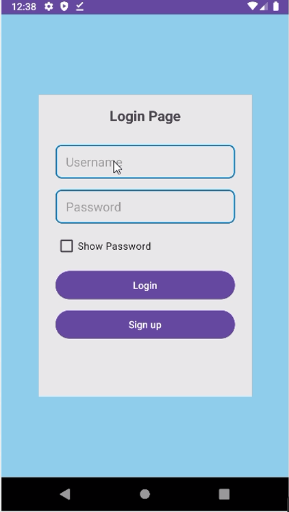

# Bus Ticket Booking App (Made by Dinesh)

This repository contains the source code for a simple bus ticket booking application. The app allows users to search for bus routes, view available seats, and book tickets for their desired journey. It provides a user-friendly interface for both customers and administrators.

### Features :

- Search for bus routes based on source and destination.
- View no. of available seats and ticket prices for selected routes.
- Admin page to manage bus routes, buses, and check ticket.
- Responsive design for seamless user experience across devices.


### Technologies Used :

- Frontend: XML
- Backend: Java
- Database: Firebase Realtime Database

### Requirements :

- Android Studio.
- Android AVD SDK version 28 or higher.
- Firebase Console 
    
### Installation :

For installing and running the project follow the following steps:

1. Clone the project
```bash
git clone https://github.com/DineshPC/Bus-Ticket-Booking-App.git
```

2. Open the project in android studio and build gradle file 

3. Open [Firebase Console](https://firebase.google.com) in browser and create new project and give any name.

4. Then go to Build option > Realtime Database , select any database location and Start in Test Mode (Not in Locked Mode) and click Enable

5. After creating the database in Firebase there is 3 dot option click on that then select import JSON then select firebase-realtime-database-data.json file which i also provide in the repository.

6. now download your google-service.json file of your project from Firebase and replace it to my google-service.json file (file in ./app folder) .( Remember to set package name to com.example.busticketbookingapp or your package name).

7. Now you can run the app 
8. For Users -- username : test ; password : 123 <br>
   For Admin -- username : aaa ; password : 123

### Screenshots :




